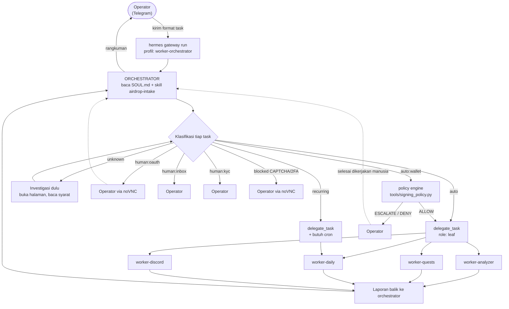
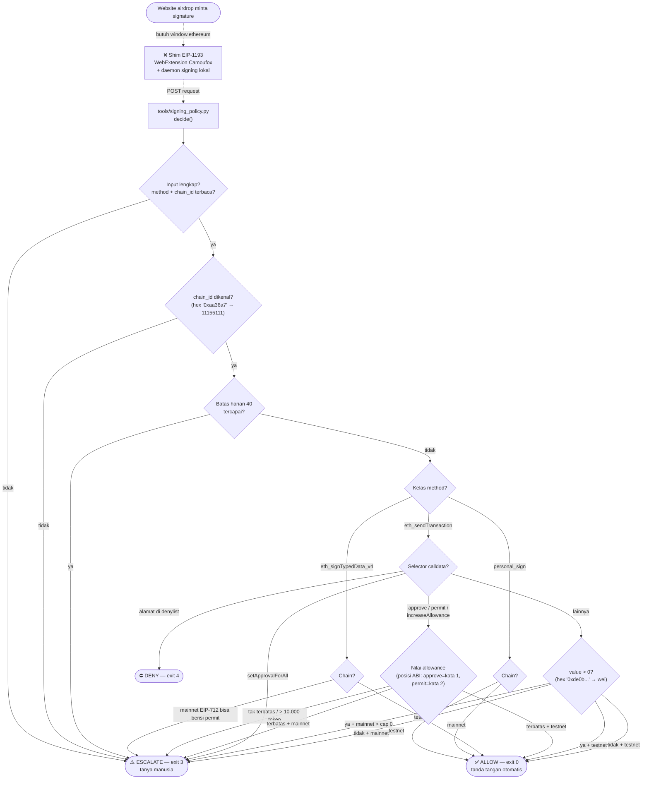
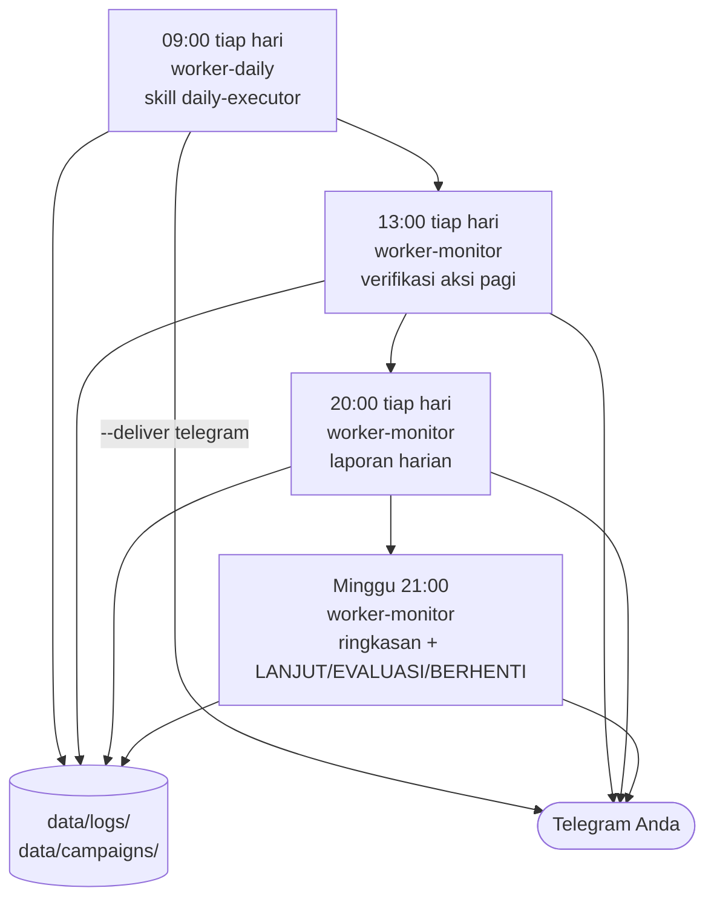

# Diagram Alur AgentDrop

Diagram ini **diturunkan dari isi repo**, bukan dari niat. Setiap panah merujuk
file yang benar-benar ada. Bagian akhir mendaftar titik yang mungkin tidak
sesuai dengan yang Anda mau — periksa bagian itu dulu.

Legenda: ✅ terpasang & terverifikasi statis · ⚠️ terpasang tapi belum diuji
hidup · ❌ belum dibangun

---

## 1. Alur utama: Telegram → orchestrator → worker

✅ Struktur delegasi terpasang. `worker-orchestrator` adalah **satu-satunya**
profil dengan `delegate_task` + `delegation`, dan satu-satunya yang punya
`platform_toolsets.telegram`.

**Batas yang terpasang** (`config/hermes/profiles/worker-orchestrator/config.yaml`):

| Setelan | Nilai | Artinya |
|---|---|---|
| `delegation.orchestrator_enabled` | `true` | delegasi aktif |
| `delegation.max_spawn_depth` | `1` | worker **tidak bisa** mendelegasikan lagi |
| `delegation.max_concurrent_children` | `3` | maksimal 3 worker paralel |
| `approvals.mode` | `smart` | aturan guardian bahasa alami |
| `approvals.cron_mode` | `deny` | job cron tidak boleh minta approval |

---

## 2. Alur browser per aksi (protokol wajib)

✅ Terpasang di **6 SOUL.md** + `skills/browser-operation/SKILL.md`.
Validator bagian `[12]` menolak build kalau bloknya hilang.

Kalau accessibility tree tidak cukup (canvas, overlay, popup) → turun ke
`browser_vision` atau `computer_use(mode='som')` (Set-of-Mark, elemen bernomor
di atas screenshot).

---

## 3. Alur signature wallet

⚠️ **Mesin kebijakan: terpasang & teruji (47 test). Shim-nya: ❌ belum dibangun.**

Postur `config/hermes/signing-policy.yaml` — **OTONOM PENUH**, sesuai keputusan
operator (wallet khusus yang dikelola agent sepenuhnya):

| Situasi | Testnet | Mainnet |
|---|---|---|
| Message signing (login/SIWE/verify) | otomatis | otomatis |
| EIP-712 typed data | otomatis | **selalu tanya** — tidak bisa dimatikan |
| Transaksi tanpa nilai (mint/claim) | otomatis | otomatis |
| Allowance terbatas | otomatis | otomatis |
| Allowance tak terbatas | otomatis | otomatis *(dicatat keras ke stderr)* |
| Transfer bernilai | otomatis | otomatis sampai **10 ETH** |
| Alamat di `spender_denylist` | **DENY** | **DENY** |
| Melebihi 1000 approve/hari | tanya | tanya |

Dua rem yang tetap aktif meski semuanya otomatis: `spender_denylist` (menang
atas semua kelonggaran, diuji di validator) dan `max_auto_approvals_per_day`
(penahan loop, bukan penahan Anda).

---

## 4. Alur eskalasi ke manusia

✅ noVNC terpasang di `config/camofox/camofox.config.json` (plugin vnc).

---

## 5. Alur terjadwal (cron)

✅ Terpasang di `scripts/install-cron.sh`. Laporan dikirim ke **Telegram**
(`CRON_DELIVER=telegram`, default). Ganti ke `local` lewat env kalau perlu.

`install-cron.sh` memperingatkan kalau `TELEGRAM_BOT_TOKEN` belum diisi, karena
tanpa itu laporan tidak akan sampai.

---

## 6. Alur pemasangan

---

## Status temuan

Enam titik sempat ditandai tidak sesuai. Tiga sudah dibereskan, tiga masih terbuka.

### ✅ A — Kontradiksi wallet: SELESAI

`worker-orchestrator/SOUL.md` tidak lagi menulis "signature -> wajib operator".
Klasifikasi `human:wallet` dipecah:

- `auto:wallet` — signature & transaksi, agent jalan terus, **policy engine yang
  memutuskan**
- `human:wallet` — hanya kalau policy engine menjawab `ESCALATE` atau `DENY`

`Submit EVM Address` juga dikoreksi: dulu masuk `human:wallet` padahal cuma
alamat publik. Sekarang `auto`.

SOUL.md sekarang menyertakan perintah nyata untuk memanggil policy engine dan
aturan tegas: *"Saya tidak menimpa keputusan policy engine. Kalau jawabannya
ESCALATE, saya tidak mencari jalan lain untuk menandatanganinya."*

### ✅ C — Skill dibatasi per profil: SELESAI

`scripts/setup.sh` sekarang punya `declare -A PROFILE_SKILLS`. Slot terpasang
turun dari **48 (6×8) menjadi 19**. `worker-discord` tidak lagi bisa memanggil
`daily-executor`.

Folder skill **dihapus lebih dulu** sebelum disalin, jadi mengeluarkan sebuah
skill dari pemetaan benar-benar mencabutnya saat setup dijalankan ulang. Tanpa
ini pembatasan hanya berlaku pada pemasangan pertama.

Validator menolak build kalau: `browser-operation` hilang dari profil mana pun,
ada skill yang tidak dipetakan ke profil mana pun, pemetaan menyebut skill yang
tidak ada, atau baris `rm -rf` dihapus. Keempatnya sudah diuji negatif.

### ✅ D — Laporan cron ke Telegram: SELESAI

`--deliver local` diganti `--deliver "$DELIVER"` dengan `CRON_DELIVER` default
`telegram`. Ada peringatan kalau `TELEGRAM_BOT_TOKEN` belum diisi.

### ❌ B — Shim EIP-1193 belum dibangun: MASIH TERBUKA

Ini satu-satunya yang membuat rute otonom belum benar-benar jalan. Policy engine
sudah teruji 47 test, tapi **tidak ada yang memanggilnya** — website tidak punya
`window.ethereum`. Yang harus dibuat: WebExtension Camoufox + daemon signing
lokal. Harus addon, karena `camofox-browser` tidak punya `addInitScript`.

### ⚠️ E — `delegation` tidak ada di `platform_toolsets.telegram`: PERLU UJI HIDUP

Orchestrator punya `delegation` di toolset utamanya, tapi daftar untuk platform
telegram hanya `delegate_task`. Perlu dijalankan sungguhan untuk memastikan
delegasi tetap jalan saat pesan datang dari Telegram — persis jalur yang Anda
pakai.

### ⚠️ F — Belum pernah dijalankan hidup

Tidak ada `docker` maupun `hermes` di lingkungan pengembangan. Semua verifikasi
statis: 56 pemeriksaan + 47 test unit + uji CLI + uji `burn-in.sh` dengan stub.

---

## Soal klaim "70-80% quest itu signature mainnet"

Diminta diverifikasi lewat pencarian. **Angka 70-80% itu tidak saya temukan di
sumber mana pun.** Yang saya temukan justru sebaliknya untuk fase farming 2026:
Monad, Arc (testnet-only), Orbinum, DAC, Kite AI, Variational, dan Retium
semuanya berbasis testnet.

Tapi ada pembedaan teknis yang lebih penting daripada angkanya:

| Yang diminta situs | Jenis | Butuh saldo mainnet? | Status di policy engine |
|---|---|---|---|
| "Connect EVM Wallet" / verify ownership | `personal_sign` — off-chain | **tidak** | **sudah otomatis** sejak awal |
| "Sign message to verify" | `personal_sign` — off-chain | **tidak** | **sudah otomatis** sejak awal |
| Mint / claim / check-in | transaksi tanpa nilai | gas saja | otomatis (baru) |
| Swap / bridge / approve | transaksi + allowance | **ya** | otomatis (baru) |
| EIP-712 typed data | bisa berisi `permit` | tidak | **tetap tanya** di mainnet |

Jadi mayoritas task "wallet" di platform quest sebenarnya **signature off-chain**
yang tidak butuh saldo — dan itu sudah otomatis bahkan sebelum perubahan ini.
Yang baru diotomatiskan adalah transaksi dan allowance mainnet sungguhan.
