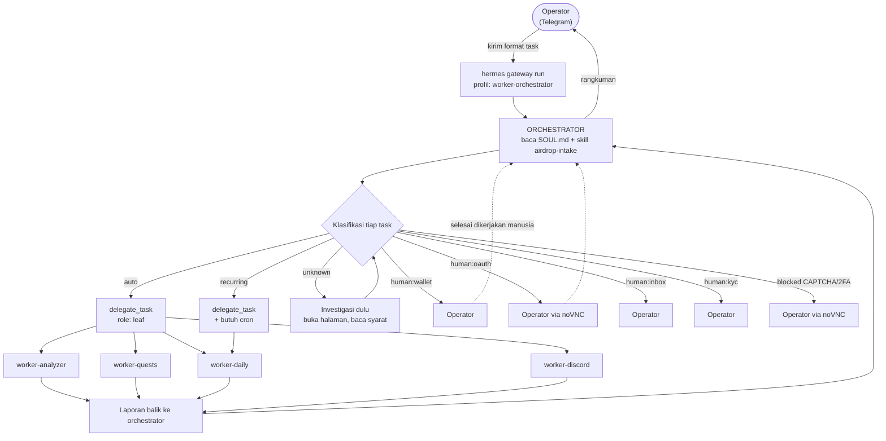
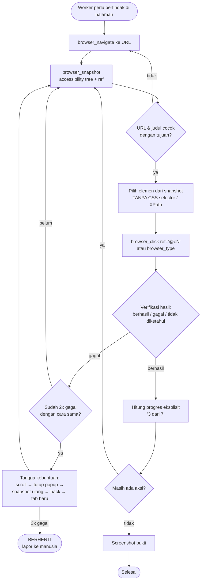
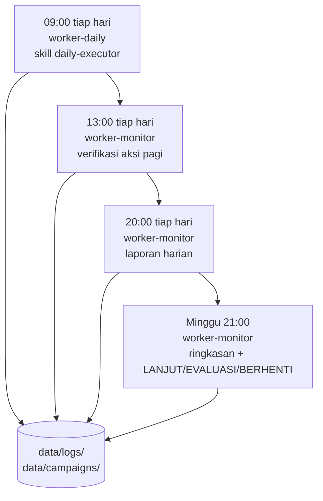
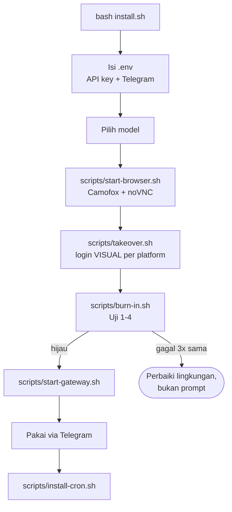

# Diagram Alur AgentDrop

Diagram ini **diturunkan dari isi repo**, bukan dari niat. Setiap panah merujuk
file yang benar-benar ada. Bagian akhir mendaftar titik yang mungkin tidak
sesuai dengan yang Anda mau — periksa bagian itu dulu.

Legenda: ✅ terpasang & terverifikasi statis · ⚠️ terpasang tapi belum diuji
hidup · ❌ belum dibangun

---

## 1. Alur utama: Telegram → orchestrator → worker

✅ Struktur delegasi terpasang. `worker-orchestrator` adalah **satu-satunya**
profil dengan `delegate_task` + `delegation`, dan satu-satunya yang punya
`platform_toolsets.telegram`.

**Batas yang terpasang** (`config/hermes/profiles/worker-orchestrator/config.yaml`):

| Setelan | Nilai | Artinya |
|---|---|---|
| `delegation.orchestrator_enabled` | `true` | delegasi aktif |
| `delegation.max_spawn_depth` | `1` | worker **tidak bisa** mendelegasikan lagi |
| `delegation.max_concurrent_children` | `3` | maksimal 3 worker paralel |
| `approvals.mode` | `smart` | aturan guardian bahasa alami |
| `approvals.cron_mode` | `deny` | job cron tidak boleh minta approval |

---

## 2. Alur browser per aksi (protokol wajib)

✅ Terpasang di **6 SOUL.md** + `skills/browser-operation/SKILL.md`.
Validator bagian `[12]` menolak build kalau bloknya hilang.

Kalau accessibility tree tidak cukup (canvas, overlay, popup) → turun ke
`browser_vision` atau `computer_use(mode='som')` (Set-of-Mark, elemen bernomor
di atas screenshot).

---

## 3. Alur signature wallet

⚠️ **Mesin kebijakan: terpasang & teruji (47 test). Shim-nya: ❌ belum dibangun.**

Postur bawaan `config/hermes/signing-policy.yaml`:

| Situasi | Testnet | Mainnet |
|---|---|---|
| Message signing (login/SIWE) | otomatis | otomatis |
| EIP-712 typed data | otomatis | **selalu tanya** |
| Transaksi tanpa nilai (mint/claim) | otomatis | **tanya** |
| Allowance terbatas | otomatis | **tanya** |
| Allowance tak terbatas | **selalu tanya** | **selalu tanya** |
| Transfer bernilai | otomatis | **tanya** (cap 0 wei) |

---

## 4. Alur eskalasi ke manusia

✅ noVNC terpasang di `config/camofox/camofox.config.json` (plugin vnc).

---

## 5. Alur terjadwal (cron)

✅ Terpasang di `scripts/install-cron.sh`. **Catatan: `--deliver local`, bukan
telegram** — lihat bagian "titik yang mungkin tidak sesuai".

---

## 6. Alur pemasangan

---

## ⚠️ Titik yang mungkin TIDAK sesuai dengan yang Anda mau

Ini temuan dari membaca repo, bukan asumsi. Mohon dikonfirmasi.

### A. Kontradiksi rute wallet — **paling penting**

Anda memilih rute otonom (policy engine), tapi
`config/hermes/profiles/worker-orchestrator/SOUL.md` masih menulis:

> `human:wallet` | "Connect EVM Wallet", sign message, bridging, deposit | **operator**
> `human:wallet` (signature -> **wajib operator**)

Artinya orchestrator akan **tetap menyerahkan semua signature ke Anda**, dan
policy engine tidak pernah dipanggil. Dua aturan ini bertentangan. Perlu
diputuskan: klasifikasi `human:wallet` dipecah jadi `auto:wallet-testnet` /
`auto:wallet-mainnet-terbatas` / `human:wallet`, atau rute otonom dibatalkan.

### B. Shim-nya belum ada

Mesin kebijakan sudah teruji, tapi tidak ada yang memanggilnya. Website tidak
punya `window.ethereum` untuk diajak bicara. Harus dibangun: WebExtension
Camoufox + daemon signing lokal. Harus addon, karena `camofox-browser` tidak
punya `addInitScript`.

### C. Semua skill disalin ke semua profil

`scripts/setup.sh` menyalin **8 skill ke 6 profil** tanpa pemetaan. Spesialisasi
hanya datang dari SOUL.md, bukan dari pembatasan skill. Kalau Anda ingin
`worker-discord` benar-benar tidak bisa memanggil `daily-executor`, itu belum
terpasang.

### D. Laporan cron tidak masuk Telegram

`install-cron.sh` memakai `--deliver local`. Laporan harian/mingguan tertulis ke
`data/logs/`, **tidak** dikirim ke Telegram Anda. Padahal alur yang Anda minta
berpusat di Telegram.

### E. `delegation` tidak ada di `platform_toolsets.telegram`

Orchestrator punya `delegation` di toolset utamanya, tapi daftar untuk platform
telegram hanya mencantumkan `delegate_task`. Perlu diuji apakah delegasi tetap
jalan saat pesan datang dari Telegram — ini persis jalur yang Anda pakai.

### F. Belum pernah dijalankan hidup

Tidak ada `docker` maupun `hermes` di lingkungan pengembangan. Semua verifikasi
bersifat statis: 54 pemeriksaan + 47 test unit + uji CLI + uji `burn-in.sh`
dengan stub.
