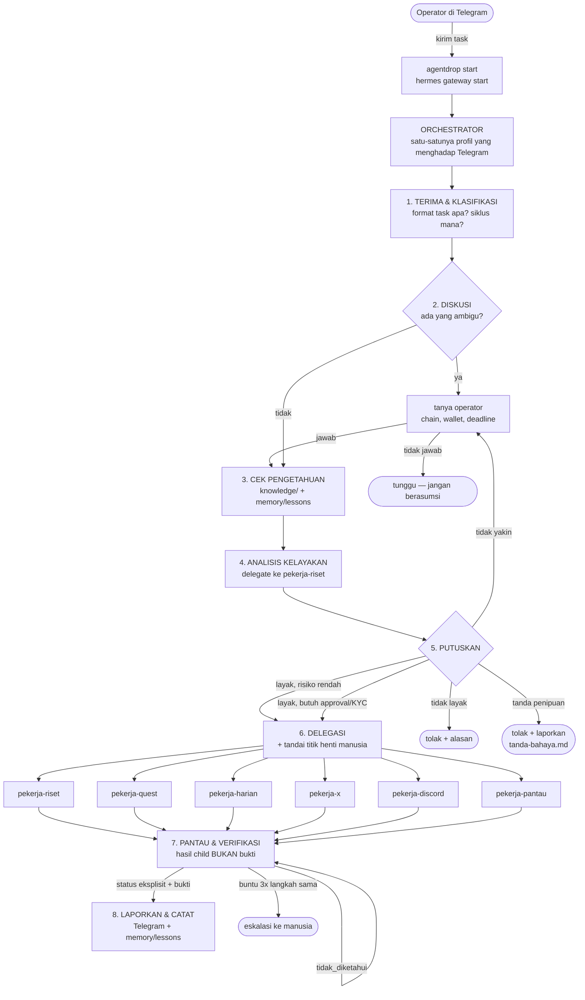
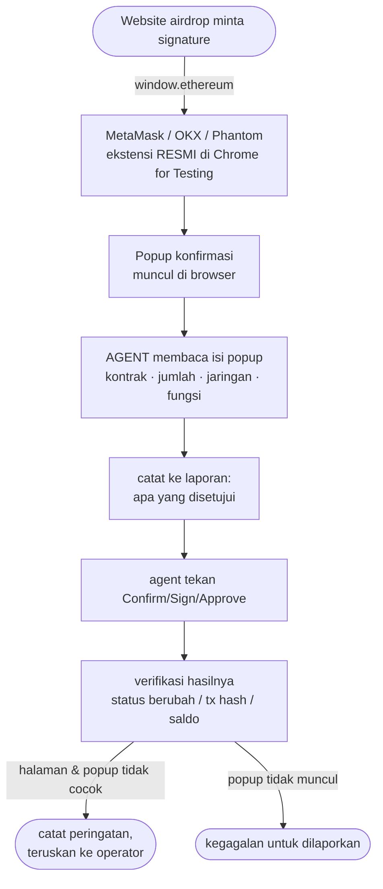
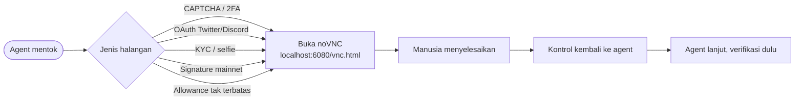
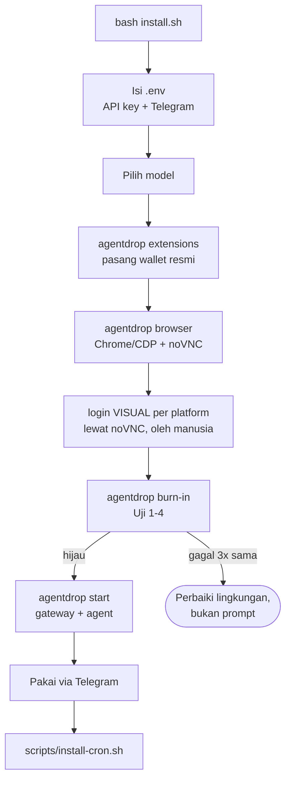

# Diagram Alur AgentDrop

Diagram ini **diturunkan dari isi repo**, bukan dari niat. Setiap panah merujuk
file yang benar-benar ada. Bagian akhir mendaftar titik yang mungkin tidak
sesuai dengan yang Anda mau — periksa bagian itu dulu.

Legenda: ✅ terpasang & terverifikasi statis · ⚠️ terpasang tapi belum diuji
hidup · ❌ belum dibangun

---

## 1. Alur utama: dari pesan Telegram sampai selesai

Gateway menyala, semua agent standby. Operator mengirim task ke bot,
orchestrator menerimanya, berdiskusi kalau perlu, lalu mendelegasikan ke
worker yang tepat. Tiap worker menjalankan **workflow-nya sendiri** yang
tertulis di `SOUL.md` masing-masing.



### Kenapa alurnya begini

- **Orchestrator tidak mengerjakan task.** Ia mengklasifikasi, memutuskan, dan
  mendelegasikan. Kalau ia ikut mengerjakan, tidak ada yang memantau.
- **Langkah 2 (diskusi) ada karena task airdrop jarang lengkap.** Chain mana,
  wallet mana, testnet atau mainnet — menebak di sini mahal dan sering tidak
  bisa diurungkan.
- **Langkah 3 sebelum riset baru.** `knowledge/` dan `memory/lessons/` lebih
  murah dan lebih benar daripada mengulang riset.
- **Langkah 7 tidak mempercayai child.** Hasil dari worker dibaca ulang:
  apakah statusnya eksplisit, apakah buktinya bisa diperiksa.

### Workflow per worker

Tiap worker punya alurnya sendiri di `SOUL.md`. Ringkasnya:

| Worker | Alur inti |
|---|---|
| `pekerja-riset` | fakta → cek knowledge → 4 dimensi → tanda bahaya → **verifikasi klaim** → verdict → tulis knowledge |
| `pekerja-harian` | baca state → buka dashboard → **cek status dulu** → eksekusi → perbarui state → lapor |
| `pekerja-quest` | baca **seluruh** daftar → peta syarat → urutkan dependensi → satu-satu → bukti → submit → verifikasi status |
| `pekerja-x` | baca task → **tentukan metode verifikasi** → eksekusi → ambil URL dari halaman → submit → lapor |
| `pekerja-discord` | **baca aturan server** → peta → cek role → verifikasi → terlibat → pastikan role bertambah |
| `pekerja-pantau` | baca state → kumpulkan → **bandingkan dengan sebelumnya** → verifikasi bukti → deteksi anomali → lapor yang berubah |

Yang dicetak tebal adalah langkah yang paling sering dilewati dan paling mahal
akibatnya.

## 2. Alur browser per aksi (protokol wajib)

✅ Terpasang di **6 SOUL.md** + `skills/browser-operation/SKILL.md`.
Validator bagian `[12]` menolak build kalau bloknya hilang.


Kalau accessibility tree tidak cukup (canvas, overlay, popup) → turun ke
`browser_vision` (screenshot halaman yang diperiksa secara visual). Kalau itu
pun tidak cukup → berhenti dan serahkan ke manusia lewat noVNC. `computer_use`
adalah toolset terpisah dan tidak diaktifkan di AgentDrop.

---

## 3. Alur signature wallet

**Berubah total sejak K7.** Dulu rencananya shim EIP-1193 bikinan sendiri plus
daemon signing lokal dengan policy engine. Rencana itu **dibatalkan**: ekstensi
non-official terdeteksi sebagai klien asing, berisiko di-ban proyek, ditolak
sebagian dApp, dan menghasilkan sidik jari gas yang seragam untuk semua
pemakainya.

Yang sekarang: **wallet resmi di browser, kunci dipegang manusia, tombol popup
ditekan agent.**

Pemisahan ini penting dan mudah tercampur. K7 melarang **ekstensi bikinan
sendiri** — itu tetap berlaku. Yang berubah di Arc 28 adalah **siapa yang
menekan `Confirm`**, bukan siapa yang memegang kunci.



### Kenapa agent yang menekan, bukan manusia

Aritmetika, bukan preferensi. 10 proyek sehari dengan 10-20 task chain
masing-masing berarti **~200 approval sehari**. Operator membangun sistem ini
supaya tetap berjalan saat ia offline; menyerahkan setiap popup ke manusia
membuatnya tidak berguna. Risikonya tidak hilang — ia **dipindahkan ke kualitas
catatan agent**, karena itu catatan wajib, bukan opsional.

### Konsekuensinya

| | |
|---|---|
| Kunci | **dipegang manusia**, di dalam wallet. Agent tidak punya dan tidak boleh mencari |
| Approval | **ditekan agent**, setelah membaca isi popup |
| `approve` unlimited | **boleh** — banyak dApp memintanya. Catat token + spender untuk revoke |
| Halaman ≠ popup | **catat peringatan, terus jalan.** Sinyal situs mencurigakan, bukan alasan berhenti |
| Wajib dicatat | fungsi, kontrak/spender, jumlah, chain — untuk **setiap** approval |
| Kalau popup tidak muncul | itu **kegagalan untuk dilaporkan**, bukan sesuatu yang diakali |

### Yang tidak boleh dilakukan agent

- Mencari, membaca, atau meminta private key, seed phrase, atau keystore
- Mengetik seed phrase ke halaman web mana pun, termasuk halaman "recover"
- Menandatangani transaksi yang **mengirim dana keluar** kecuali task memintanya
  eksplisit. Approve bukan transfer
- Melewati CAPTCHA, 2FA, OTP, atau KYC — itu tetap kelas `human`

### Kenapa tidak ada policy engine lagi

Policy engine membaca **selector 4-byte dari calldata** untuk memutuskan. Itu
tidak pernah cukup: untuk Solana tidak ada padanannya sama sekali (instruksinya
program ID + index dalam `VersionedTransaction` yang sudah terserialisasi), dan
`SetAuthority` di Solana — memindahkan kepemilikan token account, lebih parah
dari unlimited allowance dan tidak bisa dicabut dengan revoke — tidak punya
analog di sisi EVM.

Yang menggantikannya lebih sederhana dan lebih jujur: agent **membaca popup
wallet-nya langsung**, bukan menebak dari calldata. Popup menunjukkan apa yang
sebenarnya akan ditandatangani. Daemon dan policy engine masih bisa dipulihkan
kalau suatu saat dibutuhkan:

```bash
git checkout 81417dc -- tools/signing_daemon.py tools/signing_policy.py
```

## 4. Alur eskalasi ke manusia

✅ GUI datang dari noVNC yang dijalankan `agentdrop browser`
(Xvfb → x11vnc → websockify).



---

## 5. Alur terjadwal (cron)

✅ Terpasang di `scripts/install-cron.sh`. Laporan dikirim ke **Telegram**
(`CRON_DELIVER=telegram`, default). Ganti ke `local` lewat env kalau perlu.


`install-cron.sh` memperingatkan kalau `TELEGRAM_BOT_TOKEN` belum diisi, karena
tanpa itu laporan tidak akan sampai.

---

## 6. Alur pemasangan



---

## Status temuan

Enam titik sempat ditandai tidak sesuai. **Lima sudah ditutup** (A, B, C, D, E) dan **satu masih terbuka** (F — belum pernah dijalankan hidup).

### ✅ A — Kontradiksi wallet: SELESAI

`pekerja-koordinator/SOUL.md` tidak lagi menulis "signature -> wajib operator"
tanpa penjelasan. Yang menggantikannya **berubah lagi sejak K7**, jadi catatan
aslinya perlu dibaca dengan hati-hati:

- Dulu keputusannya diserahkan ke policy engine (`auto:wallet` jalan terus,
  `human:wallet` hanya kalau engine menjawab `ESCALATE`/`DENY`).
- **Policy engine sudah dihapus** (K7 — tidak ada ekstensi bikinan sendiri, jadi
  tidak ada pemanggilnya).
- **Keputusan operator (Arc 28): tidak ada lagi kelas `human:wallet`.** Semua
  task wallet masuk kelas `wallet` dan dikerjakan agent sampai selesai,
  termasuk menekan `Confirm`/`Sign`/`Approve`. Alasannya aritmetika: 10 proyek
  sehari × 10-20 task chain = ~200 approval, dan sistem ini dibangun supaya
  tetap berjalan saat operator offline. Yang tetap dipegang manusia adalah
  **kunci**, bukan tombol di popup. CAPTCHA, 2FA, OTP, dan KYC tetap `human`.

Yang **tetap benar** dari temuan ini: `Submit EVM Address` bukan tindakan
wallet. Ia cuma menyerahkan alamat publik, jadi masuk `auto`, bukan `wallet`.
Koreksi itu masih berlaku.

### ✅ C — Skill dibatasi per profil: SELESAI

`lib/30-hermes.sh` punya `declare -A PROFILE_SKILLS`. Slot terpasang
turun dari **48 (6×8) menjadi 19**. `pekerja-discord` tidak lagi bisa memanggil
`daily-executor`.

Folder skill **dihapus lebih dulu** sebelum disalin, jadi mengeluarkan sebuah
skill dari pemetaan benar-benar mencabutnya saat setup dijalankan ulang. Tanpa
ini pembatasan hanya berlaku pada pemasangan pertama.

Validator menolak build kalau: `browser-operation` hilang dari profil mana pun,
ada skill yang tidak dipetakan ke profil mana pun, pemetaan menyebut skill yang
tidak ada, atau baris `rm -rf` dihapus. Keempatnya sudah diuji negatif.

### ✅ D — Laporan cron ke Telegram: SELESAI

`--deliver local` diganti `--deliver "$DELIVER"` dengan `CRON_DELIVER` default
`telegram`. Ada peringatan kalau `TELEGRAM_BOT_TOKEN` belum diisi.

### ✅ B — Shim EIP-1193: DITUTUP DENGAN MENGHAPUSNYA

**Ditutup dengan menghapusnya.** Dulu rencananya membuat WebExtension sendiri
plus daemon signing lokal. Rencana itu dibatalkan (AGENTS.md K7): ekstensi
non-official terdeteksi sebagai klien asing, berisiko di-ban proyek, dan
ditolak sebagian dApp.

Yang dipakai sekarang: wallet resmi (MetaMask/OKX/Phantom) yang diunduh ke
Chrome for Testing. Kuncinya dipegang manusia, approval ditandatangani lewat
noVNC. Daemon signing dan policy engine ikut dihapus karena tidak punya
pemanggil lagi — masih bisa dipulihkan dari commit `81417dc`.

### ✅ E — `delegation` tidak ada di `platform_toolsets.telegram`: SELESAI

Ternyata lebih buruk dari catatan semula. `delegate_task` **bukan id toolset** —
ia nama *tool* di dalam toolset `delegation`
(`toolsets.py: "delegation": {"tools": ["delegate_task"]}`). Jadi daftar
telegram mencantumkan tool di tempat id, dan orchestrator menerima pesan
Telegram yang tidak bisa ia delegasikan.

Diverifikasi mekanis terhadap id toolset asli di `toolsets.py:TOOLSETS` (**34**
id): AgentDrop memakai 7, tepat satu tidak valid.

*(Angka ini sempat tertulis 58. Tidak ada sumber Hermes yang berisi 58 id —
`toolsets.py:TOOLSETS` punya 34, `tools_config.py:CONFIGURABLE_TOOLSETS` punya
26, gabungannya 35. Datanya sendiri benar dan isinya diverifikasi identik
dengan sumber; hanya angkanya yang keliru.)*

Yang ikut terbuka: `TOOLSET_IDS` di validator ditulis tangan dan berisi **8 nama
karangan** (`a2a`, `bfl`, `delegate_task`, `execute_code`, `image_generate`,
`stt`, `text_to_speech`, `vision_analyze`) sambil kehilangan 32 yang asli —
itulah sebabnya nilai yang salah itu lolos. Sudah dibangun ulang dari sumber.
Ada juga pemeriksaan yang menuntut `delegate_task` **dan** `delegation`, jadi
ia justru memaksa nilai yang tidak valid; sekarang hanya menuntut `delegation`.

Guard regresi ditambahkan di `platform_toolsets.telegram`, diuji mutasi:
mencabut `delegation` membuat validator exit 1.

### ⚠️ F — Belum pernah dijalankan hidup

Tidak ada `docker` maupun `hermes` di lingkungan pengembangan. Semua verifikasi
statis: 56 pemeriksaan + 47 test unit + uji CLI + uji `burn-in.sh` dengan stub.

---

## Komposisi task airdrop (klarifikasi operator, 2026-08-26)

Klaim awal "70-80% quest itu signature mainnet" saya cari dan **angka persisnya
tidak ketemu di sumber mana pun**. Operator lalu memperjelas maksudnya, dan
versi yang diperjelas ini konsisten dengan apa yang saya temukan:

- Yang 70-80% itu adalah **signature + approve**, bukan swap/bridge.
- Swap/bridge **jarang**, kecuali proyek terpercaya (Coinbase, ZeroChain, dst).
- Platform quest pihak ketiga (Galxe, QuestN, dll.) memang mainnet, **tapi
  minatnya menurun**. Developer sekarang lebih memilih membangun quest di
  platform sendiri — datanya mereka kuasai dan bisa dipakai, plus lebih mudah
  memfilter peserta.
- Di platform quest mandiri itu **mayoritas meminta approve di mainnet**, karena
  dApp/DEX-nya dibangun di atas chain yang sudah mainnet: Base, ETH, Solana,
  BNB, Arbitrum.

### Konsekuensi teknis yang harus dicatat

Empat dari lima chain itu EVM. **Solana bukan.**

| Chain | Model | `chain_id` | Bisa dibaca agent? |
|---|---|---|---|
| Ethereum | EVM | 1 | selector calldata terbaca |
| Base | EVM | 8453 | selector calldata terbaca |
| BNB Chain | EVM | 56 | selector calldata terbaca |
| Arbitrum One | EVM | 42161 | selector calldata terbaca |
| Optimism | EVM | 10 | selector calldata terbaca |
| Polygon | EVM | 137 | selector calldata terbaca |
| Avalanche | EVM | 43114 | selector calldata terbaca |
| **Solana** | **SVM, Ed25519** | **tidak ada** | **tidak — butuh deserialisasi `VersionedTransaction`** |

Fakta per chain ada di `knowledge/chains/`. Kolom terakhir yang penting: untuk
EVM agent bisa menjelaskan apa yang diminta sebuah transaksi dari calldata-nya;
untuk Solana tidak bisa, jadi agent wajib menyerahkan ke manusia **dengan
penjelasan dari situs**, bukan popup tanpa konteks.

Angka di atas diverifikasi terhadap chainlist / evmchainlist pada 2026-08-27.

**Catatan: policy engine sudah dihapus (K7).** Analisis di bawah ini tetap
disimpan karena menjelaskan sesuatu yang masih berlaku — kenapa Solana butuh
perlakuan berbeda, dan kenapa manusia yang menyetujui di Phantom perlu
memahami apa yang dilihatnya.

Dulu `tools/signing_policy.py` membaca **selector 4-byte dari calldata EVM**
(`0x095ea7b3` = `approve`) untuk memutuskan. Solana tidak punya padanannya:
instruksinya berupa program ID + index instruksi dalam `VersionedTransaction`
yang sudah terserialisasi, dan ditandatangani lewat `signTransaction` /
`signAllTransactions`, bukan `eth_sendTransaction`.

Artinya secara praktis: **agent tidak bisa membaca maksud sebuah transaksi
Solana dari datanya**, tidak seperti EVM. Jadi untuk Solana, agent wajib
menyerahkan ke manusia dengan menjelaskan apa yang diminta situs — bukan
menyajikan popup tanpa konteks.

Padanan "approve" di Solana juga berbeda bentuk bahayanya:

| EVM | Solana (SPL Token) | Catatan |
|---|---|---|
| `approve(spender, amount)` | `Approve` / `ApproveChecked` | delegasi sejumlah token |
| `setApprovalForAll` | — | tidak ada padanan langsung |
| *(tidak ada padanan)* | **`SetAuthority`** | **memindahkan kepemilikan token account — lebih parah dari unlimited allowance, dan tidak bisa dicabut dengan revoke** |

Jadi `SetAuthority` di Solana adalah vektor yang **tidak punya analog** di sisi
EVM, dan policy engine saat ini tidak bisa melihatnya sama sekali.
